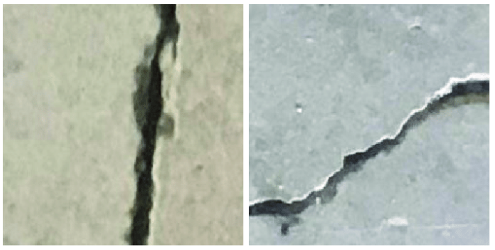
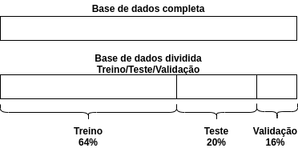
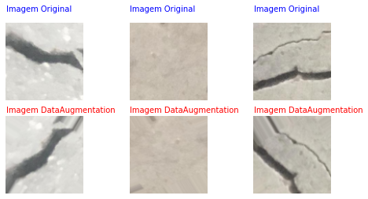
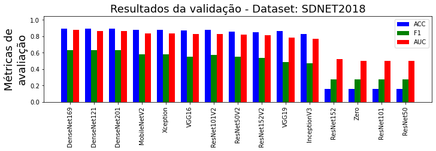
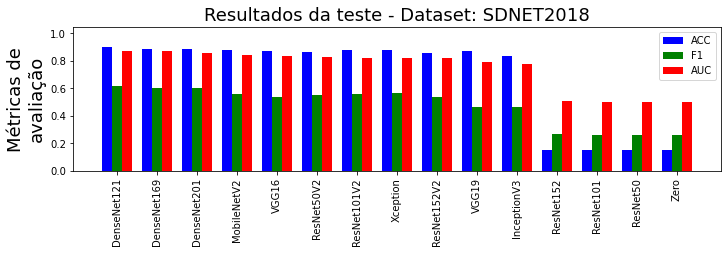
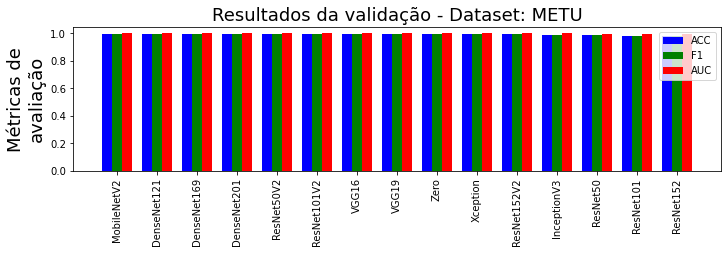
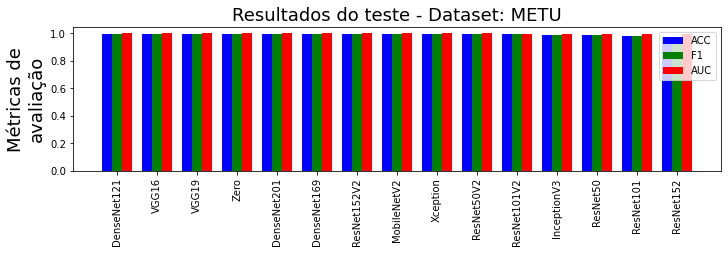
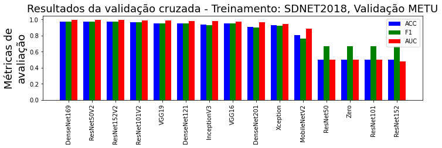
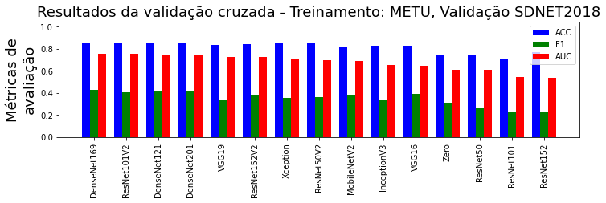

# Detecção de trinca em concreto usando visão computacional

Autores:
 - Eduardo de Andrade Nogueira (Escola Politécnica de Engenharia - USP)
 - Renan Buosi Ferreira (Escola Politécnica de Engenharia - USP)

Resumo:
Tarefas que exigem mão de obra humana especializada são caras e seus tempos de execução são altos, sendo este o caso da detecção de trincas em concreto por inspeção visual. Dessa forma, vemos na literatura diversos trabalhos buscando automatizar esse processo, dentros os quais se destacam aqueles que adotam redes neurais convolucionais. Portanto, ao considerar que o dataset de treinamento tem papel crucial na performance desse tipo de algoritmo, compararamos a performance de diversas arquiteturas para dois datasets distintos, e avaliamos suas influências, além de identificarmos qual deles produz os melhores resultados. 

## Introdução

O monitoramento de falhas estruturais maximiza a vida útil das construções civis e reduz significativamente o custo de manutenções, tarefa que, nos dias de hoje, é normalmente realizada por especialistas, cuja capacidade de inspeção é limitada, sendo seus custos elevados. Por estes motivos, vemos a busca de estratégias automatizadas para identificação de falhas, dentre as quais destacamos aquelas baseadas em análise computacional de imagens.

Ademais, a aplicação de redes neurais profundas tem sido bem sucedida em vários problemas similares, no que citamos os seguintes exemplos:
	
 - **Detecção de defeitos superficiais no aço**: O autor foi capaz de classificar seis diferentes tipos de defeito superficial em chapas de aço por meio de uma rede neural convolucional;
		
 - **Detecção de falha em máquinas rotativas**: O autor por meio dos sinais de vibração coletado de um acelerômetro foi possível a classificação de quatro falhas no motor elétrico.
		

Não por coincidênciam, encontramos diversos trabalhos na literatura em que vemos a adoção de redes neurais convolucionais profundas, caminho o qual seguiremos.
	
    
Antes de seguirmos com a detecção das fissuras, cabe destacar que elas podem ocorrer por diversos motivos, no que citamos: i) Dilatação térmica da estrutura como um todo, ii) Impacto ou vibração causada por ente externo, dentre outros motivos.
    
Aliás, as fissuras podem ocorrer em uma infinidade de variações, que dependerá de diversos fatores, como o material e a geometria da estrutura, as condições ambientais em que o material é exposto dentre outros.
    
Somando à esses pontos, quando tomamos fotografamos tais falhas, acabamos por introduzir outros ruídos em nossos dados de entrada, os quais são devidos à variações na exposição à luz, que pode ser homogênea ou não (presença de sombras), oclusão ou presença de texturas nas imagens, distorções opticas dependendo da distância e das lentes da câmera, isto para citar apenas algumas das fontes de perturbações.

Isto posto, e considerando que a performance de algoritmos baseados em rede neurais depende muito da qualidade do dataset de treinamento, isto é, não basta termos uma arquitetura adequada, ela precisa estar com os parâmetros bem ajustados, acabamos por estudar no presente trabalho a utilização de dois datasets tidos como benchmarks, no que compararamos a performance das redes neurais, treinadas com as mesmas condições nos outros parâmetros e hiper-parâmetros, para então identificarmos qual dentre esses dois produz modelos mais eficazes.
    
Os datasets supracitados, os quais serão descritos detalhadamento na próxima seção, em que será dado destaque em suas distinções, são os seguintes:
        
 - **SDNET2018**: An annotated image dataset for non-contact concrete crack detection using deep convolutional neural networks;
        
 - **METU**: Concrete Crack Images for Classification.

Na sequência, seção PreProcessamento, apontaremos os métodos utilizados no pré-processamento das imagens, no que utilizamos técnicas de aumentação de dados, uma vez que redes neurais profundas exigem grandes quantidades de samples para treinamento.

Já nas seções ArquiteturaModelo e TreinamentoValidacao serão descritas as arquiteturas de rede neural adotadas, bem como o processo de treinamento, respectivamente.

Por fim, nas duas últimas seções discutiremos os resultados obtidos para cada um dos datasets, deixando explícitas as diferenças de performance para cada um deles, no que procuramos avaliar os motivos para tais.

## DATASETS de imagens

### METU

A base de dados aqui referenciada como METU, foi assim batizada em função do seu local de coleta, Middle East Technical University, situado em Ancara, Turquia. Ela é composta de 40000 imagens, todas com três canais de cor (RGB), sendo a quantidade de imagens com ou sem rachaduras a mesma.

Essa versão publicada já é resultado do processamento de outro dataset de menor volume, porêm, com imagens de maior resolução, dessa forma, já identificamos aqui a possibilidade de introdução de erros.

Ao verificar o mecanismo de busca acadêmica do Google, em 15 de dezembro de 2021, identificamos 65 citações diretas à esse dataset, o que demonstra certa popularidade ao considerarmos os poucos anos em que essas imagens estão disponíveis.

Ao inspecionarmos visualmente uma amostra desse dataset, notamos que apesar das imagens serem coloridas, sua grande maioria apresenta basicamente escalas de cinza e algumas variações, conforme podemos observar na figura abaixo.

  

    
Outro fato importante a ser citado, também advindo da observação direta da base de dados, é que as imagens são em sua maioria límpidas, bem focadas e sem interferência de outros objetos.

### SDNET2018
    
Como segunda opção de dataset temos a SDNET2018, que é composta de aproximadamente 56000 exemplares, havendo um desbalanceamento entre as classes positivas (com rachaduras variando de 0,06 até 25 mm) e negativas, em que existem mais imagens sem rachaduras.

Além, cabe reassaltar que encontramos nessa base de dados várias imagens com ruídos externos naturais, no que citamos a presença de obstruções, sombras, rugosidades, degraus, bordas e buracos, conforme podemos visualizar na figura SDNET. Como alguns desses defeitos podem se assemelar com rachaduras, é natural esperar que a utilização desse dataset ajudaria a rede neural a distinguir essas ocorrências naturais das rachaduras, de fato.

Dessa forma, vemos uma grande diferença entre esse dataset e o apresentado na subseção anterior, sendo que na primeira delas temos imagens com muitas variações de cor e textura, dificultando a identificação das rachaduras até por seres humanos, enquanto que na última, vemos exemplares muito bem caracterizados.

Assim como a METU, a SDNET2018 é também resultado do processamento de fotos tiradas em um Campus universitário, nesse caso da Utah State University Campus, Logan, Utah, USA, sendo que imagens de maiores resolução foram segmentadadas em subimagens de 256 pixels quadrados.

  

Podemos considerar essa base de dados também como popular nesse ramo da pesquisa, uma vez que o mecanismo de busca acadêmica do Google apontou 72 citações em 15 de dezembro de 2021, sendo que sua idade é semelhante à da METU.

## Pré-processamento das imagens

Para cada um dos datasets realizamos uma sequência de manipulações, descritas a seguir, cujo intuito foi preparar as imagens para os processos de treinamento, validação e teste das redes neurais, para tal, reservamos 64%, 16% e 20% para cada partição dos dados, respectivamente, no que culminamos com a segmentação ilustrada na figura abaixo. Ao mesmo tempo que realizamos essa separação, realizamos também o resizing de cada imagem, obtendo inputs para as redes neurais com as seguintes dimensões (96, 96, 3).
    

  

Ademais, redes neurais profundas demandam grandes quantidades de exemplares quando do seu treinamento, dessa forma, utilizaremos algumas técnicas para criação de dados sintéticos a partir das bases de dados originais, vide a figura abaixo para exemplos, isto somente para os dados utilizados no treinamento, quais sejam: 
    
 - Rotação planar aleatória com ângulo máximo de 60 graus;
 - Deslocamento aleatórios nos eixos horizontal e vertical de no máximo 20% da largura ou altura;
 - Alongamento/retração aleatório de no máximo 20% do tamanho da imagem;
 - Zoom aleatório de no máximo 20% do tamanho da imagem;
 - Reflexão no eixo horizontal.
    

  

    
Após essas transformações, cada canal de cor das imagens foi corrigido por um fator de escala de 1/255, garantindo que seus valores irão variar entre 0 e 1. Esse processo também foi implementado nos datasets de validação e teste.

    
O processo de data augmentation foi aplicado a todas as imagens de treinamento e a cada época do treinamento foi definido um valor de variação a ser aplicado.
    

## Resultados e discussão

### Resultados da modelagem com dataset SDNET2018

|    | ModeloBase   |   Threshold |   TN |   FP |   FN |   TP |      ACC |       PR |       RE |       F1 |      AUC |     Erro |   TempoTreinamento |
|---:|:-------------|------------:|-----:|-----:|-----:|-----:|---------:|---------:|---------:|---------:|---------:|---------:|-------------------:|
|  0 | DenseNet169  |       0.654 | 7186 |  382 |  588 |  819 | 0.891922 | 0.681932 | 0.58209  | 0.628067 | 0.875508 | 0.108078 |            4922.82 |
|  1 | DenseNet121  |       0.653 | 7247 |  321 |  611 |  796 | 0.896156 | 0.712623 | 0.565743 | 0.630745 | 0.866365 | 0.103844 |            5381.43 |
|  2 | DenseNet201  |       0.54  | 7234 |  334 |  604 |  803 | 0.895487 | 0.706245 | 0.570718 | 0.631289 | 0.865351 | 0.104513 |            3670.54 |
|  3 | MobileNetV2  |       0.654 | 7181 |  387 |  678 |  729 | 0.881337 | 0.653226 | 0.518124 | 0.577883 | 0.832957 | 0.118663 |            1999.09 |
|  4 | Xception     |       0.496 | 7110 |  458 |  649 |  758 | 0.876657 | 0.623355 | 0.538735 | 0.577964 | 0.832563 | 0.123343 |           13902.4  |
|  5 | VGG16        |       0.568 | 7138 |  430 |  712 |  695 | 0.872758 | 0.617778 | 0.493959 | 0.548973 | 0.83131  | 0.127242 |           12929.9  |
|  6 | ResNet101V2  |       0.634 | 7156 |  412 |  673 |  734 | 0.879109 | 0.640489 | 0.521677 | 0.57501  | 0.830098 | 0.120891 |            5754.03 |
|  7 | ResNet50V2   |       0.574 | 6880 |  688 |  616 |  791 | 0.854708 | 0.534821 | 0.562189 | 0.548164 | 0.821664 | 0.145292 |            3436.44 |
|  8 | ResNet152V2  |       0.534 | 6822 |  746 |  625 |  782 | 0.847242 | 0.51178  | 0.555792 | 0.532879 | 0.813006 | 0.152758 |            8154.95 |
|  9 | VGG19        |       0.674 | 7231 |  337 |  851 |  556 | 0.867632 | 0.62262  | 0.395167 | 0.483478 | 0.786958 | 0.132368 |           13415.8  |
| 10 | InceptionV3  |       0.52  | 6769 |  799 |  724 |  683 | 0.830306 | 0.460864 | 0.48543  | 0.472828 | 0.773073 | 0.169694 |            1423.26 |
| 11 | ResNet152    |       0.443 |    4 | 7564 |    0 | 1407 | 0.157214 | 0.156839 | 1        | 0.271151 | 0.524514 | 0.842786 |            7899.33 |
| 12 | Zero         |       0     |    0 | 7568 |    0 | 1407 | 0.156769 | 0.156769 | 1        | 0.271046 | 0.5      | 0.843231 |            1046.82 |
| 13 | ResNet101    |       0.495 |    1 | 7567 |    0 | 1407 | 0.15688  | 0.156786 | 1        | 0.271072 | 0.499975 | 0.84312  |            4949.53 |
| 14 | ResNet50     |       0     |    0 | 7568 |    0 | 1407 | 0.156769 | 0.156769 | 1        | 0.271046 | 0.499645 | 0.843231 |            3931.16 |

  

|    | ModeloBase   |   Threshold |   TN |   FP |   FN |   TP |      ACC |       PR |       RE |       F1 |      AUC |     Erro |   TempoPredict |
|---:|:-------------|------------:|-----:|-----:|-----:|-----:|---------:|---------:|---------:|---------:|---------:|---------:|---------------:|
|  0 | DenseNet121  |       0.653 | 9143 |  379 |  768 |  929 | 0.897763 | 0.710245 | 0.547437 | 0.618303 | 0.872375 | 0.102237 |        82.466  |
|  1 | DenseNet169  |       0.654 | 9020 |  502 |  749 |  948 | 0.888493 | 0.653793 | 0.558633 | 0.602479 | 0.870784 | 0.111507 |       100.485  |
|  2 | DenseNet201  |       0.54  | 9041 |  481 |  754 |  943 | 0.889919 | 0.662219 | 0.555687 | 0.604293 | 0.860188 | 0.110081 |       130.066  |
|  3 | MobileNetV2  |       0.654 | 9013 |  509 |  845 |  852 | 0.879312 | 0.62601  | 0.502062 | 0.557227 | 0.839889 | 0.120688 |        39.6645 |
|  4 | VGG16        |       0.568 | 8986 |  536 |  873 |  824 | 0.874409 | 0.605882 | 0.485563 | 0.539091 | 0.838485 | 0.125591 |       227.009  |
|  5 | ResNet50V2   |       0.574 | 8704 |  818 |  743 |  954 | 0.860861 | 0.538375 | 0.562169 | 0.550014 | 0.827416 | 0.139139 |        70.6721 |
|  6 | ResNet101V2  |       0.634 | 9004 |  518 |  843 |  854 | 0.878688 | 0.622449 | 0.503241 | 0.556533 | 0.822307 | 0.121312 |       135.042  |
|  7 | Xception     |       0.496 | 8953 |  569 |  805 |  892 | 0.877529 | 0.610541 | 0.525633 | 0.564915 | 0.81961  | 0.122471 |       148.878  |
|  8 | ResNet152V2  |       0.534 | 8639 |  883 |  752 |  945 | 0.854265 | 0.516958 | 0.556865 | 0.53617  | 0.819564 | 0.145735 |       200.457  |
|  9 | VGG19        |       0.674 | 9103 |  419 | 1054 |  643 | 0.868705 | 0.605461 | 0.378904 | 0.466111 | 0.792589 | 0.131295 |       283.19   |
| 10 | InceptionV3  |       0.52  | 8611 |  911 |  907 |  790 | 0.837953 | 0.464433 | 0.465527 | 0.464979 | 0.774956 | 0.162047 |        36.0022 |
| 11 | ResNet152    |       0.443 |    7 | 9515 |    0 | 1697 | 0.151885 | 0.151356 | 1        | 0.262917 | 0.508122 | 0.848115 |       219.299  |
| 12 | ResNet101    |       0.495 |    2 | 9520 |    1 | 1696 | 0.15135  | 0.151213 | 0.999411 | 0.262681 | 0.499915 | 0.84865  |       150.483  |
| 13 | ResNet50     |       0     |    0 | 9522 |    0 | 1697 | 0.151261 | 0.151261 | 1        | 0.262775 | 0.499863 | 0.848739 |        84.277  |
| 14 | Zero         |       0     |    0 | 9522 |    0 | 1697 | 0.151261 | 0.151261 | 1        | 0.262775 | 0.499705 | 0.848739 |        11.329  |

  

### Resultados da modelagem com dataset METU

|    | ModeloBase   |   Threshold |   TN |   FP |   FN |   TP |      ACC |       PR |       RE |       F1 |      AUC |       Erro |   TempoTreinamento |
|---:|:-------------|------------:|-----:|-----:|-----:|-----:|---------:|---------:|---------:|---------:|---------:|-----------:|-------------------:|
|  0 | MobileNetV2  |       0.624 | 3121 |    5 |    3 | 3271 | 0.99875  | 0.998474 | 0.999084 | 0.998779 | 0.999993 | 0.00125    |            828.336 |
|  1 | DenseNet121  |       0.631 | 3118 |    8 |    2 | 3272 | 0.998437 | 0.997561 | 0.999389 | 0.998474 | 0.999983 | 0.0015625  |           1719.22  |
|  2 | DenseNet169  |       0.326 | 3117 |    9 |    3 | 3271 | 0.998125 | 0.997256 | 0.999084 | 0.998169 | 0.999983 | 0.001875   |           2768.46  |
|  3 | DenseNet201  |       0.59  | 3121 |    5 |    4 | 3270 | 0.998594 | 0.998473 | 0.998778 | 0.998626 | 0.999979 | 0.00140625 |           2166.73  |
|  4 | ResNet50V2   |       0.823 | 3126 |    0 |   10 | 3264 | 0.998437 | 1        | 0.996946 | 0.99847  | 0.999965 | 0.0015625  |           1436.45  |
|  5 | ResNet101V2  |       0.746 | 3120 |    6 |   12 | 3262 | 0.997188 | 0.998164 | 0.996335 | 0.997249 | 0.999957 | 0.0028125  |           4853.59  |
|  6 | VGG16        |       0.478 | 3120 |    6 |    4 | 3270 | 0.998437 | 0.998168 | 0.998778 | 0.998473 | 0.999932 | 0.0015625  |           1997.38  |
|  7 | VGG19        |       0.732 | 3123 |    3 |    6 | 3268 | 0.998594 | 0.999083 | 0.998167 | 0.998625 | 0.999922 | 0.00140625 |           2218.17  |
|  8 | Zero         |       0.265 | 3108 |   18 |    7 | 3267 | 0.996094 | 0.994521 | 0.997862 | 0.996188 | 0.999814 | 0.00390625 |           1194.64  |
|  9 | Xception     |       0.656 | 3117 |    9 |   15 | 3259 | 0.99625  | 0.997246 | 0.995418 | 0.996331 | 0.99978  | 0.00375    |           1190.09  |
| 10 | ResNet152V2  |       0.262 | 3112 |   14 |   13 | 3261 | 0.995781 | 0.995725 | 0.996029 | 0.995877 | 0.999671 | 0.00421875 |           5280.94  |
| 11 | InceptionV3  |       0.523 | 3096 |   30 |   33 | 3241 | 0.990156 | 0.990828 | 0.989921 | 0.990374 | 0.999339 | 0.00984375 |           1083.76  |
| 12 | ResNet50     |       0.26  | 3067 |   59 |   25 | 3249 | 0.986875 | 0.982164 | 0.992364 | 0.987238 | 0.999019 | 0.013125   |           1997.34  |
| 13 | ResNet101    |       0.614 | 3079 |   47 |   71 | 3203 | 0.981563 | 0.985538 | 0.978314 | 0.981913 | 0.997906 | 0.0184375  |           2883.61  |
| 14 | ResNet152    |       0.394 | 3067 |   59 |   78 | 3196 | 0.978594 | 0.981874 | 0.976176 | 0.979017 | 0.997475 | 0.0214062  |           6622.63  |

  

|    | ModeloBase   |   Threshold |   TN |   FP |   FN |   TP |      ACC |       PR |      RE |       F1 |      AUC |     Erro |   TempoPredict |
|---:|:-------------|------------:|-----:|-----:|-----:|-----:|---------:|---------:|--------:|---------:|---------:|---------:|---------------:|
|  0 | DenseNet121  |       0.631 | 3989 |   11 |    6 | 3994 | 0.997875 | 0.997253 | 0.9985  | 0.997876 | 0.999945 | 0.002125 |       53.2273  |
|  1 | VGG16        |       0.478 | 3983 |   17 |    1 | 3999 | 0.99775  | 0.995767 | 0.99975 | 0.997754 | 0.999935 | 0.00225  |       21.7904  |
|  2 | VGG19        |       0.732 | 3986 |   14 |    5 | 3995 | 0.997625 | 0.996508 | 0.99875 | 0.997628 | 0.999909 | 0.002375 |       24.6501  |
|  3 | Zero         |       0.265 | 3969 |   31 |    7 | 3993 | 0.99525  | 0.992296 | 0.99825 | 0.995264 | 0.999894 | 0.00475  |        4.99357 |
|  4 | DenseNet201  |       0.59  | 3989 |   11 |    2 | 3998 | 0.998375 | 0.997256 | 0.9995  | 0.998377 | 0.999821 | 0.001625 |       84.6632  |
|  5 | DenseNet169  |       0.326 | 3980 |   20 |    1 | 3999 | 0.997375 | 0.995024 | 0.99975 | 0.997381 | 0.999816 | 0.002625 |       71.1784  |
|  6 | ResNet152V2  |       0.262 | 3979 |   21 |   11 | 3989 | 0.996    | 0.994763 | 0.99725 | 0.996005 | 0.999783 | 0.004    |       47.3165  |
|  7 | MobileNetV2  |       0.624 | 3990 |   10 |    5 | 3995 | 0.998125 | 0.997503 | 0.99875 | 0.998126 | 0.999697 | 0.001875 |       18.2937  |
|  8 | Xception     |       0.656 | 3986 |   14 |   20 | 3980 | 0.99575  | 0.996495 | 0.995   | 0.995747 | 0.999693 | 0.00425  |       23.3278  |
|  9 | ResNet50V2   |       0.823 | 3992 |    8 |   20 | 3980 | 0.9965   | 0.997994 | 0.995   | 0.996495 | 0.999556 | 0.0035   |       28.1046  |
| 10 | ResNet101V2  |       0.746 | 3980 |   20 |   13 | 3987 | 0.995875 | 0.995009 | 0.99675 | 0.995879 | 0.999146 | 0.004125 |       36.9543  |
| 11 | InceptionV3  |       0.523 | 3955 |   45 |   32 | 3968 | 0.990375 | 0.988786 | 0.992   | 0.990391 | 0.999102 | 0.009625 |       35.9257  |
| 12 | ResNet50     |       0.26  | 3924 |   76 |   34 | 3966 | 0.98625  | 0.981197 | 0.9915  | 0.986322 | 0.998923 | 0.01375  |       24.4402  |
| 13 | ResNet101    |       0.614 | 3942 |   58 |   96 | 3904 | 0.98075  | 0.985361 | 0.976   | 0.980658 | 0.998155 | 0.01925  |       33.2451  |
| 14 | ResNet152    |       0.394 | 3915 |   85 |  104 | 3896 | 0.976375 | 0.978649 | 0.974   | 0.976319 | 0.997565 | 0.023625 |       42.3798  |

  

### Resultados da validação Cruzada: Treinamento com Dataset SDNET2018 e Teste com dataset METU

|    | ModeloBase   |   Threshold |   TN |   FP |   FN |   TP |      ACC |       PR |      RE |       F1 |      AUC |     Erro |   TempoPredict |
|---:|:-------------|------------:|-----:|-----:|-----:|-----:|---------:|---------:|--------:|---------:|---------:|---------:|---------------:|
|  0 | DenseNet169  |       0.654 | 3912 |   88 |  121 | 3879 | 0.973875 | 0.977817 | 0.96975 | 0.973767 | 0.995243 | 0.026125 |       57.1726  |
|  1 | ResNet50V2   |       0.574 | 3886 |  114 |   88 | 3912 | 0.97475  | 0.971684 | 0.978   | 0.974832 | 0.9936   | 0.02525  |       25.4131  |
|  2 | ResNet152V2  |       0.534 | 3888 |  112 |  124 | 3876 | 0.9705   | 0.971916 | 0.969   | 0.970456 | 0.992463 | 0.0295   |       47.1754  |
|  3 | ResNet101V2  |       0.634 | 3935 |   65 |  192 | 3808 | 0.967875 | 0.983217 | 0.952   | 0.967357 | 0.991943 | 0.032125 |       35.2418  |
|  4 | VGG19        |       0.674 | 3953 |   47 |  326 | 3674 | 0.953375 | 0.987369 | 0.9185  | 0.95169  | 0.986984 | 0.046625 |       24.4386  |
|  5 | DenseNet121  |       0.653 | 3913 |   87 |  302 | 3698 | 0.951375 | 0.977015 | 0.9245  | 0.950032 | 0.980704 | 0.048625 |       40.1835  |
|  6 | InceptionV3  |       0.52  | 3883 |  117 |  404 | 3596 | 0.934875 | 0.968489 | 0.899   | 0.932452 | 0.978069 | 0.065125 |       30.3479  |
|  7 | VGG16        |       0.568 | 3917 |   83 |  298 | 3702 | 0.952375 | 0.978071 | 0.9255  | 0.95106  | 0.976216 | 0.047625 |       21.8076  |
|  8 | DenseNet201  |       0.54  | 3912 |   88 |  637 | 3363 | 0.909375 | 0.9745   | 0.84075 | 0.902698 | 0.968955 | 0.090625 |       69.1275  |
|  9 | Xception     |       0.496 | 3899 |  101 |  487 | 3513 | 0.9265   | 0.972053 | 0.87825 | 0.922774 | 0.942707 | 0.0735   |       21.9562  |
| 10 | MobileNetV2  |       0.654 | 3951 |   49 | 1499 | 2501 | 0.8065   | 0.980784 | 0.62525 | 0.763664 | 0.886902 | 0.1935   |       15.1083  |
| 11 | ResNet50     |       0     |    0 | 4000 |    0 | 4000 | 0.5      | 0.5      | 1       | 0.666667 | 0.500125 | 0.5      |       21.7259  |
| 12 | Zero         |       0     |    0 | 4000 |    0 | 4000 | 0.5      | 0.5      | 1       | 0.666667 | 0.5      | 0.5      |        3.66225 |
| 13 | ResNet101    |       0.495 |    0 | 4000 |    6 | 3994 | 0.49925  | 0.499625 | 0.9985  | 0.666    | 0.49775  | 0.50075  |       31.2222  |
| 14 | ResNet152    |       0.443 |    0 | 4000 |    9 | 3991 | 0.498875 | 0.499437 | 0.99775 | 0.665666 | 0.481566 | 0.501125 |       40.506   |

  

### Resultados da validação Cruzada: Treinamento com Dataset METU e Teste com dataset SDNET2018

|    | ModeloBase   |   Threshold |   TN |   FP |   FN |   TP |      ACC |       PR |       RE |       F1 |      AUC |     Erro |   TempoPredict |
|---:|:-------------|------------:|-----:|-----:|-----:|-----:|---------:|---------:|---------:|---------:|---------:|---------:|---------------:|
|  0 | DenseNet169  |       0.326 | 8869 |  653 | 1061 |  636 | 0.847223 | 0.493406 | 0.374779 | 0.425988 | 0.75361  | 0.152777 |       113.869  |
|  1 | ResNet101V2  |       0.746 | 9010 |  512 | 1135 |  562 | 0.853195 | 0.523277 | 0.331173 | 0.40563  | 0.75173  | 0.146805 |        60.3381 |
|  2 | DenseNet121  |       0.631 | 9031 |  491 | 1127 |  570 | 0.85578  | 0.537229 | 0.335887 | 0.413343 | 0.740671 | 0.14422  |        84.5546 |
|  3 | DenseNet201  |       0.59  | 9084 |  438 | 1131 |  566 | 0.860148 | 0.563745 | 0.33353  | 0.419104 | 0.738665 | 0.139852 |       138.359  |
|  4 | VGG19        |       0.732 | 8873 |  649 | 1234 |  463 | 0.83216  | 0.416367 | 0.272834 | 0.329655 | 0.72442  | 0.16784  |        40.2081 |
|  5 | ResNet152V2  |       0.262 | 8904 |  618 | 1164 |  533 | 0.841162 | 0.463076 | 0.314084 | 0.374298 | 0.722873 | 0.158838 |        71.4089 |
|  6 | Xception     |       0.656 | 9092 |  430 | 1242 |  455 | 0.850967 | 0.514124 | 0.26812  | 0.35244  | 0.71481  | 0.149033 |        38.5566 |
|  7 | ResNet50V2   |       0.823 | 9160 |  362 | 1247 |  450 | 0.856583 | 0.554187 | 0.265174 | 0.358709 | 0.69808  | 0.143417 |        50.2137 |
|  8 | MobileNetV2  |       0.624 | 8532 |  990 | 1067 |  630 | 0.81665  | 0.388889 | 0.371243 | 0.379861 | 0.692539 | 0.18335  |        28.5598 |
|  9 | InceptionV3  |       0.523 | 8831 |  691 | 1216 |  481 | 0.830021 | 0.41041  | 0.283441 | 0.335308 | 0.650969 | 0.169979 |        58.6502 |
| 10 | VGG16        |       0.478 | 8706 |  816 | 1087 |  610 | 0.830377 | 0.42777  | 0.359458 | 0.39065  | 0.647179 | 0.169623 |        35.3056 |
| 11 | Zero         |       0.265 | 7786 | 1736 | 1064 |  633 | 0.750423 | 0.267201 | 0.373011 | 0.311363 | 0.610435 | 0.249577 |         6.4201 |
| 12 | ResNet50     |       0.26  | 7848 | 1674 | 1177 |  520 | 0.745878 | 0.23701  | 0.306423 | 0.267283 | 0.60696  | 0.254122 |        39.2692 |
| 13 | ResNet101    |       0.614 | 7513 | 2009 | 1224 |  473 | 0.711828 | 0.190572 | 0.278727 | 0.22637  | 0.541166 | 0.288172 |        53.0622 |
| 14 | ResNet152    |       0.394 | 8239 | 1283 | 1308 |  389 | 0.769053 | 0.232656 | 0.229228 | 0.230929 | 0.538167 | 0.230947 |        64.2609 |

  

### Resultados da modelagem com extração de features com dataset SDNET2018

| Mode      |   TN |   FP |   FN |   TP |      ACC |   PR |   RE |   F1 |     Erro |
|:----------|-----:|-----:|-----:|-----:|---------:|-----:|-----:|-----:|---------:|
| Validação | 7611 |    0 | 1364 |    0 | 0.848022 |    0 |    0 |    0 | 0.151978 |
| Teste     | 9522 |    0 | 1697 |    0 | 0.848739 |    0 |    0 |    0 | 0.151261 |

  

### Resultados da modelagem com extração de features com dataset METU

| Mode      |   TN |   FP |   FN |   TP |     ACC |       PR |       RE |       F1 |    Erro |
|:----------|-----:|-----:|-----:|-----:|--------:|---------:|---------:|---------:|--------:|
| Validação | 3023 |  251 |   21 | 3105 | 0.9575  | 0.925209 | 0.993282 | 0.958038 | 0.0425  |
| Teste     | 3692 |  308 |   38 | 3962 | 0.95675 | 0.927869 | 0.9905   | 0.958162 | 0.04325 |

  

## Referências

 - Christophe Simler, Erik Trostmann, and Dirk Berndt. Automatic crack detection on concrete floor images. In Bernhard Zagar, Pawel Mazurek, Maik Rosenberger, and Paul-Gerald Dittrich, editors, Photonics and Education in Measurement Science 2019. SPIE, September 2019.
 - Asifullah Khan, Anabia Sohail, Umme Zahoora, and Aqsa Saeed Qureshi. A survey of the recent architectures of deep convolutional neural networks. CoRR, abs/1901.06032, 2019.
 - Linda Wang and Alexander Wong. Covid-net: A tailored deep convolutional neural network design for detection of covid-19 cases from chest x-ray images, 2020.
 - Yiping Gao, Liang Gao, Xinyu Li, and Xuguo Yan. A semi-supervised convolutional neural network-based method for steel surface defect recognition. Robotics and Computer-Integrated Manufacturing, 61:101825, February 2020.
 - Davor Kolar, Dragutin Lisjak, Michał Pajak, and Danijel Pavkovi ́c. Fault diagnosis of rotary machines using deep convolutional neural network with wide three axis vibration signal input. Sensors, 20(14):4017, July 2020.
 - Tom B. Brown, Benjamin Mann, Nick Ryder, Melanie Subbiah, Jared Kaplan, Prafulla Dhariwal, Arvind Neelakantan, Pranav Shyam, Girish Sastry, Amanda Askell, Sandhini Agarwal, Ariel Herbert-Voss, Gretchen Krueger, Tom Henighan, Rewon Child, Aditya Ramesh, Daniel M. Ziegler, Jeffrey Wu, Clemens Winter, Christopher Hesse, Mark Chen, Eric Sigler, Mateusz Litwin, Scott Gray, Benjamin Chess, Jack Clark, Christopher Berner, Sam McCandlish, Alec Radford, Ilya Sutskever, and Dario Amodei. Language models are few-shot learners, 2020.
 - Sattar Dorafshan, Robert J. Thomas, and Marc Maguire. SDNET2018: An annotated image dataset for non-contact concrete crack detection using deep convolutional neural networks. Data in Brief, 21:1664–1668, December 2018.
 - undefineda  ̆glar Fırat  ̈Ozgenel. Concrete crack images for classification, 2019.
 - Sattar Dorafshan and Marc Maguire. Autonomous detection of concrete cracks on bridge decks and fatigue cracks on steel members. Digital Imaging 2017, pages 33–44, 2017.
 - Sattar Dorafshan, Marc Maguire, and Minwoo Chang. Comparing automated image-based crack detection techniques in the spatial and frequency domains. In 26th ASNT Research Symposium, pages 34–42, 2017.
 - Sattar Dorafshan, Marc Maguire, Nathan V Hoffer, and Calvin Coopmans. Challenges in bridge inspection using small unmanned aerial systems: Results and lessons learned. In 2017 International Conference on Unmanned Aircraft Systems (ICUAS), pages 1722–1730. IEEE, 2017.
 - Sattar Dorafshan, Robert J Thomas, Calvin Coopmans, and Marc Maguire. Deep learning neural networks for suas-assisted structural inspections: Feasibility and application. In 2018 International Conference on Unmanned Aircraft Systems (ICUAS), pages 874–882. IEEE, 2018.
 - Sattar Dorafshan, Marc Maguire, and Yuqin Qian. Automatic surface crack detection in concrete structures using otsu thresholding and morphological operations. 2016.
 - Sattar Dorafshan, Robert J Thomas, and Marc Maguire. Comparison of deep convolutional neural networks and edge detectors for image based crack detection in concrete. Construction and Building Materials, 186:1031–1045, 2018.
 - Wilson Ricardo Leal da Silva and Diogo Schwerz de Lucena. Concrete cracks detection based on deep learning image classification. Proceedings, 2(8):489, June 2018.
 - Cao Vu Dung and Le Duc Anh. Autonomous concrete crack detection using deep fully convolutional neural network. Automation in Construction, 99:52–58, March 2019.
 - Hyunjun Kim, Eunjong Ahn, Myoungsu Shin, and Sung-Han Sim. Crack and noncrack classification from concrete surface images using machine learning. Structural Health Monitoring, 18(3):725–738, April 2018.
 - Seungbo Shim, Jin Kim, Gye-Chun Cho, and Seong-Won Lee. Multiscale and adversarial learning-based semi-supervised semantic segmentation approach for crack detection in concrete structures. IEEE Access, 8:170939–170950, 2020.
 - Lei Zhang, Fan Yang, Yimin Daniel Zhang, and Ying Julie Zhu. Road crack detection using deep convolutional neural network. IEEE, September 2016.
 - Yahui Liu, Jian Yao, Xiaohu Lu, Renping Xie, and Li Li. DeepCrack: A deep hierarchical feature learning architecture for crack segmentation. Neurocomputing, 338:139–153, April 2019.
 - Gao Huang, Zhuang Liu, Laurens van der Maaten, and Kilian Q. Weinberger. Densely connected convolutional networks, 2018.
 - Mark Sandler, Andrew Howard, Menglong Zhu, Andrey Zhmoginov, and Liang-Chieh Chen. Mobilenetv2: Inverted residuals and linear bottlenecks, 2019.
 - Franc ̧ois Chollet. Xception: Deep learning with depthwise separable convolutions, 2017.
 - Christian Szegedy, Vincent Vanhoucke, Sergey Ioffe, Jonathon Shlens, and Zbigniew Wojna. Rethinking the inception architecture for computer vision, 2015.
 - Karen Simonyan and Andrew Zisserman. Very deep convolutional networks for large-scale image recognition, 2015.
 - Kaiming He, Xiangyu Zhang, Shaoqing Ren, and Jian Sun. Deep residual learning for image recognition, 2015.
 - Christian Szegedy, Sergey Ioffe, Vincent Vanhoucke, and Alex Alemi. Inception-v4, inception-resnet and the impact of residual connections on learning, 2016.
