# Ciencia-Dos-Dados-Projeto

Projeto Final da disciplina de Ciencia dos dados

## Resultados do processamento com o dataset METU

Essa seção apresenta os resultados do processamento com o dataset METU

### Resultados modelo DenseNet121

Historico de treinamento:

Curva ROC/AUC:

Curva Recall Precisão e F1:
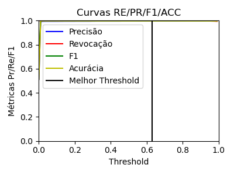

Amostra do predict:

### Resultados modelo DenseNet169

Historico de treinamento:
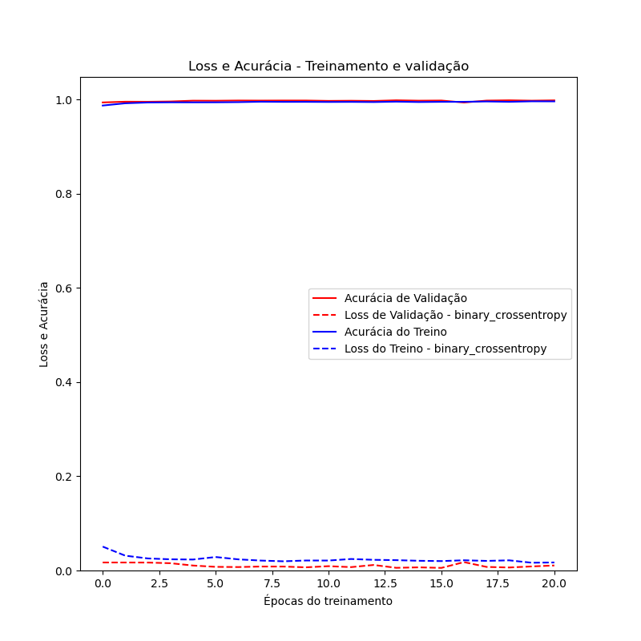

Curva ROC/AUC:

Curva Recall Precisão e F1:

Amostra do predict:

### Resultados modelo DenseNet201

Historico de treinamento:

Curva ROC/AUC:

Curva Recall Precisão e F1:

Amostra do predict:

### Resultados modelo InceptionV3

Historico de treinamento:

Curva ROC/AUC:

Curva Recall Precisão e F1:

Amostra do predict:

### Resultados modelo MobileNetV2

Historico de treinamento:

Curva ROC/AUC:

Curva Recall Precisão e F1:

Amostra do predict:

### Resultados modelo ResNet101

Historico de treinamento:
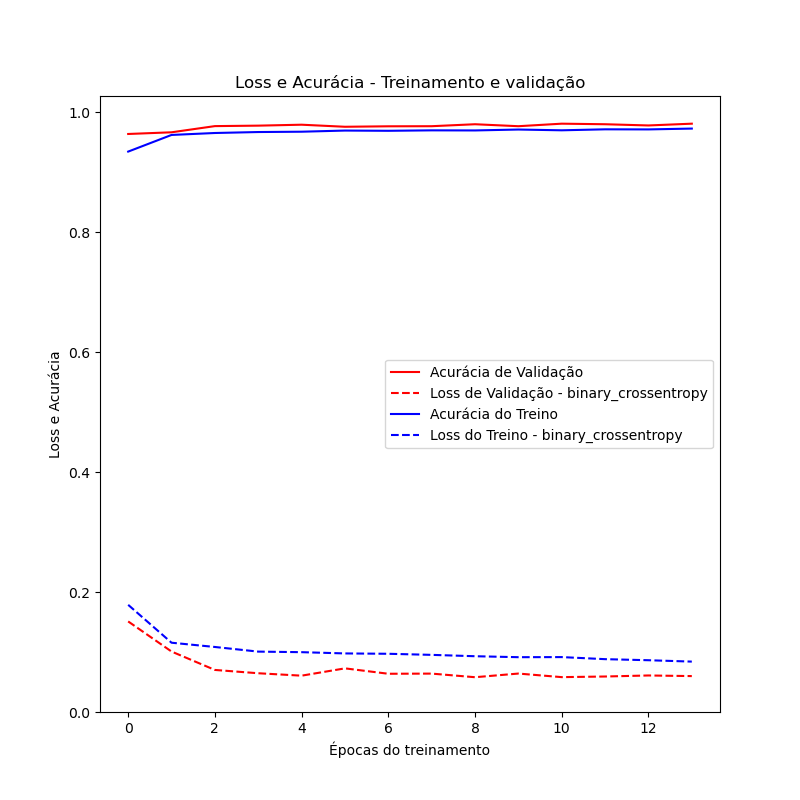

Curva ROC/AUC:

Curva Recall Precisão e F1:

Amostra do predict:
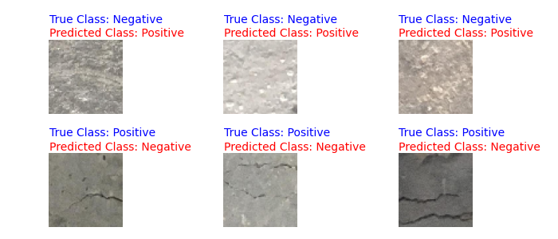

### Resultados modelo ResNet101V2

Historico de treinamento:

Curva ROC/AUC:

Curva Recall Precisão e F1:

Amostra do predict:

### Resultados modelo ResNet152

Historico de treinamento:
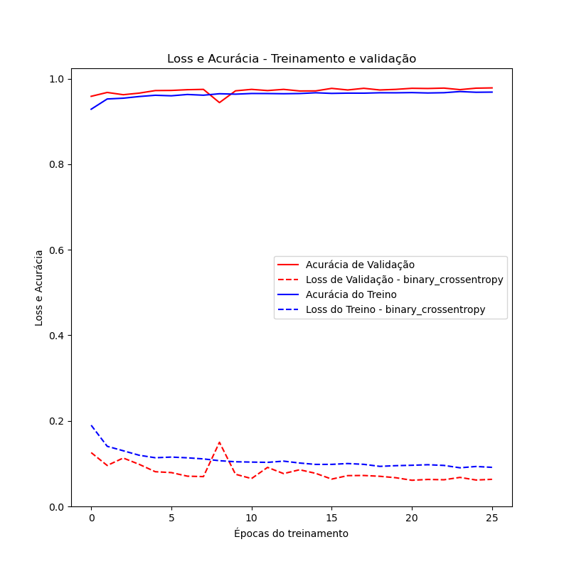

Curva ROC/AUC:

Curva Recall Precisão e F1:

Amostra do predict:

### Resultados modelo ResNet152V2

Historico de treinamento:

Curva ROC/AUC:

Curva Recall Precisão e F1:

Amostra do predict:

### Resultados modelo ResNet50

Historico de treinamento:

Curva ROC/AUC:

Curva Recall Precisão e F1:
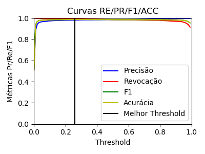

Amostra do predict:

### Resultados modelo ResNet50V2

Historico de treinamento:

Curva ROC/AUC:

Curva Recall Precisão e F1:

Amostra do predict:

### Resultados modelo VGG16

Historico de treinamento:

Curva ROC/AUC:

Curva Recall Precisão e F1:

Amostra do predict:

### Resultados modelo VGG19

Historico de treinamento:
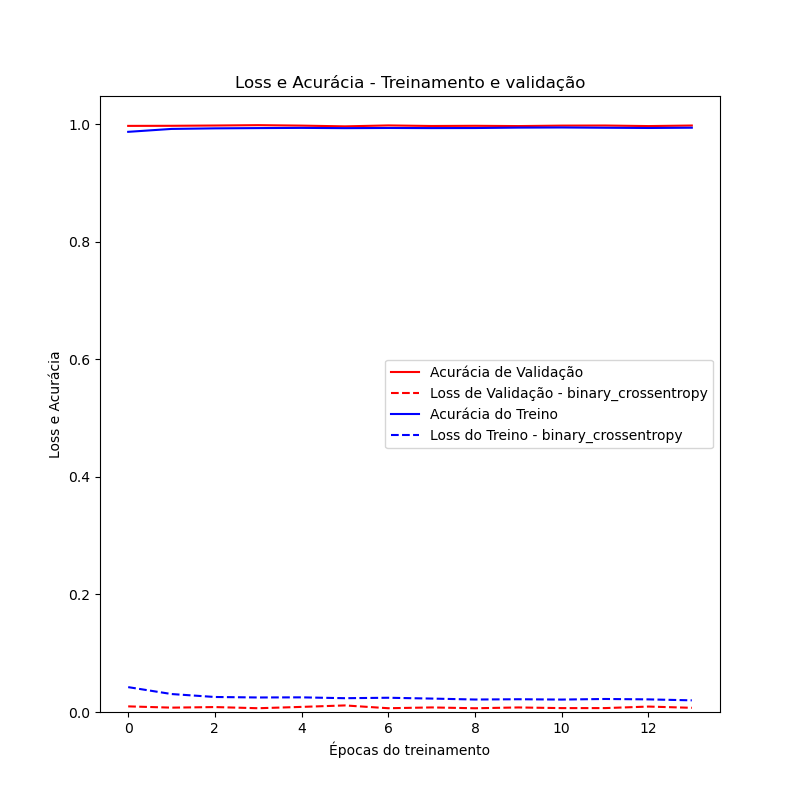

Curva ROC/AUC:

Curva Recall Precisão e F1:

Amostra do predict:

### Resultados modelo Xception

Historico de treinamento:

Curva ROC/AUC:

Curva Recall Precisão e F1:

Amostra do predict:

### Resultados modelo treinado do zero

Historico de treinamento:

Curva ROC/AUC:

Curva Recall Precisão e F1:

Amostra do predict:

## Resultados do processamento com o dataset SDNET

Essa seção apresenta os resultados do processamento com o dataset SDNET

### Resultados modelo DenseNet121

Historico de treinamento:

Curva ROC/AUC:

Curva Recall Precisão e F1:

Amostra do predict:

### Resultados modelo DenseNet169

Historico de treinamento:

Curva ROC/AUC:

Curva Recall Precisão e F1:

Amostra do predict:

### Resultados modelo DenseNet201

Historico de treinamento:
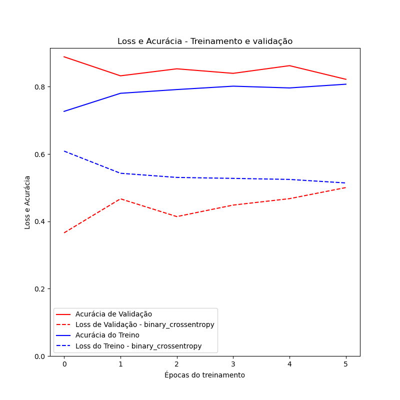

Curva ROC/AUC:

Curva Recall Precisão e F1:

Amostra do predict:

### Resultados modelo InceptionV3

Historico de treinamento:

Curva ROC/AUC:

Curva Recall Precisão e F1:

Amostra do predict:

### Resultados modelo MobileNetV2

Historico de treinamento:

Curva ROC/AUC:

Curva Recall Precisão e F1:

Amostra do predict:
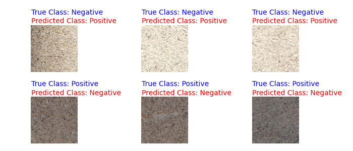

### Resultados modelo ResNet101

Historico de treinamento:

Curva ROC/AUC:

Curva Recall Precisão e F1:

Amostra do predict:

### Resultados modelo ResNet101V2

Historico de treinamento:

Curva ROC/AUC:

Curva Recall Precisão e F1:

Amostra do predict:

### Resultados modelo ResNet152

Historico de treinamento:

Curva ROC/AUC:

Curva Recall Precisão e F1:
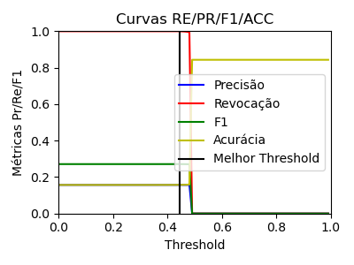

Amostra do predict:

### Resultados modelo ResNet152V2

Historico de treinamento:
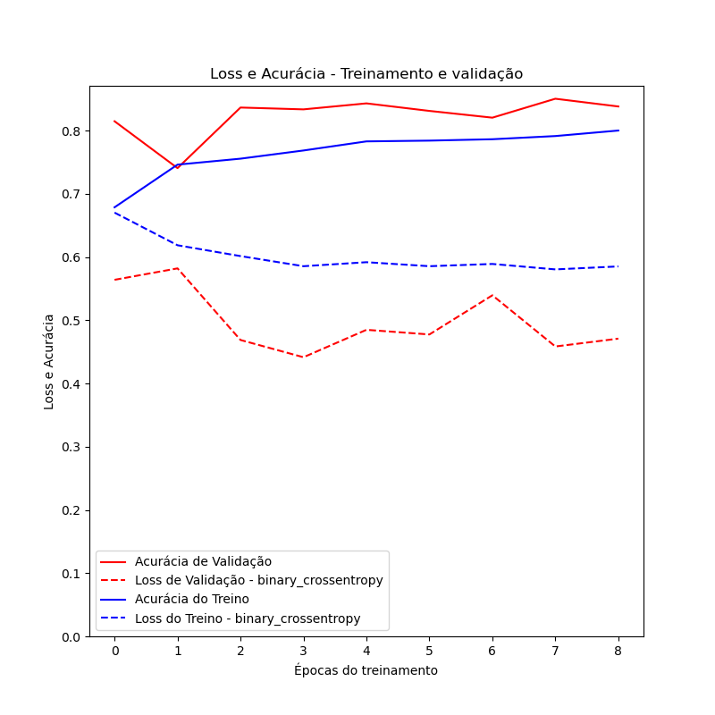

Curva ROC/AUC:

Curva Recall Precisão e F1:

Amostra do predict:

### Resultados modelo ResNet50

Historico de treinamento:

Curva ROC/AUC:

Curva Recall Precisão e F1:

Amostra do predict:

### Resultados modelo ResNet50V2

Historico de treinamento:

Curva ROC/AUC:
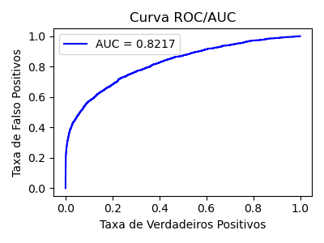

Curva Recall Precisão e F1:

Amostra do predict:

### Resultados modelo VGG16

Historico de treinamento:
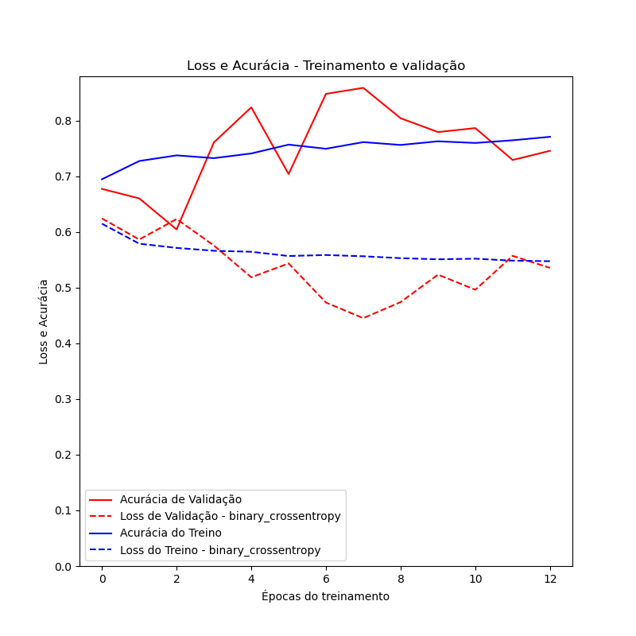

Curva ROC/AUC:

Curva Recall Precisão e F1:

Amostra do predict:

### Resultados modelo VGG19

Historico de treinamento:

Curva ROC/AUC:

Curva Recall Precisão e F1:

Amostra do predict:

### Resultados modelo Xception

Historico de treinamento:

Curva ROC/AUC:

Curva Recall Precisão e F1:

Amostra do predict:

### Resultados modelo treinado do zero

Historico de treinamento:

Curva ROC/AUC:

Curva Recall Precisão e F1:

Amostra do predict:
