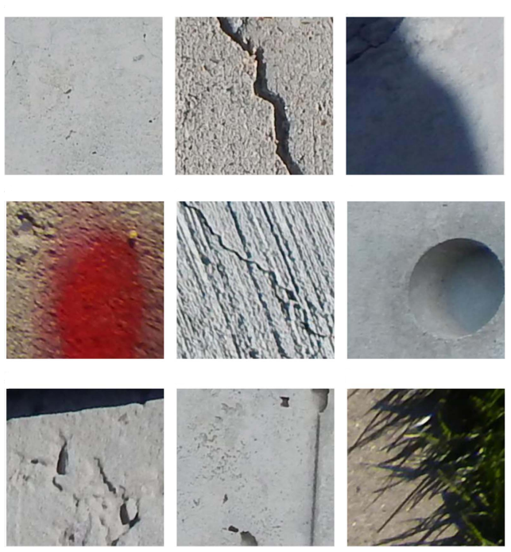
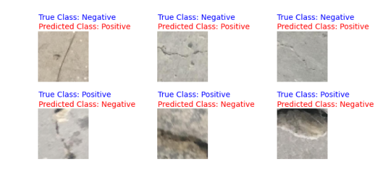

# Detecção de trinca em concreto usando visão computacional

Autores:
 - Eduardo de Andrade Nogueira (Escola Politécnica de Engenharia - USP)
 - Renan Buosi Ferreira (Escola Politécnica de Engenharia - USP)

Resumo:
Tarefas que exigem mão de obra humana especializada são caras e seus tempos de execução são altos, sendo este o caso da detecção de trincas em concreto por inspeção visual. Dessa forma, vemos na literatura diversos trabalhos buscando automatizar esse processo, dentros os quais se destacam aqueles que adotam redes neurais convolucionais. Portanto, ao considerar que o dataset de treinamento tem papel crucial na performance desse tipo de algoritmo, compararamos a performance de diversas arquiteturas para dois datasets distintos, e avaliamos suas influências, além de identificarmos qual deles produz os melhores resultados. 

## Introdução

O monitoramento de falhas estruturais maximiza a vida útil das construções civis e reduz significativamente o custo de manutenções, tarefa que, nos dias de hoje, é normalmente realizada por especialistas, cuja capacidade de inspeção é limitada, sendo seus custos elevados. Por estes motivos, vemos a busca de estratégias automatizadas para identificação de falhas, dentre as quais destacamos aquelas baseadas em análise computacional de imagens.

Ademais, a aplicação de redes neurais profundas tem sido bem sucedida em vários problemas similares, no que citamos os seguintes exemplos:
	
 - **Detecção de defeitos superficiais no aço**: O autor foi capaz de classificar seis diferentes tipos de defeito superficial em chapas de aço por meio de uma rede neural convolucional;
		
 - **Detecção de falha em máquinas rotativas**: O autor por meio dos sinais de vibração coletado de um acelerômetro foi possível a classificação de quatro falhas no motor elétrico.
		

Não por coincidênciam, encontramos diversos trabalhos na literatura em que vemos a adoção de redes neurais convolucionais profundas, caminho o qual seguiremos.
	
    
Antes de seguirmos com a detecção das fissuras, cabe destacar que elas podem ocorrer por diversos motivos, no que citamos: i) Dilatação térmica da estrutura como um todo, ii) Impacto ou vibração causada por ente externo, dentre outros motivos.
    
Aliás, as fissuras podem ocorrer em uma infinidade de variações, que dependerá de diversos fatores, como o material e a geometria da estrutura, as condições ambientais em que o material é exposto dentre outros.
    
Somando à esses pontos, quando tomamos fotografamos tais falhas, acabamos por introduzir outros ruídos em nossos dados de entrada, os quais são devidos à variações na exposição à luz, que pode ser homogênea ou não (presença de sombras), oclusão ou presença de texturas nas imagens, distorções opticas dependendo da distância e das lentes da câmera, isto para citar apenas algumas das fontes de perturbações.

Isto posto, e considerando que a performance de algoritmos baseados em rede neurais depende muito da qualidade do dataset de treinamento, isto é, não basta termos uma arquitetura adequada, ela precisa estar com os parâmetros bem ajustados, acabamos por estudar no presente trabalho a utilização de dois datasets tidos como benchmarks, no que compararamos a performance das redes neurais, treinadas com as mesmas condições nos outros parâmetros e hiper-parâmetros, para então identificarmos qual dentre esses dois produz modelos mais eficazes.
    
Os datasets supracitados, os quais serão descritos detalhadamento na próxima seção, em que será dado destaque em suas distinções, são os seguintes:
        
 - **SDNET2018**: An annotated image dataset for non-contact concrete crack detection using deep convolutional neural networks;
        
 - **METU**: Concrete Crack Images for Classification.

Na sequência, seção PreProcessamento, apontaremos os métodos utilizados no pré-processamento das imagens, no que utilizamos técnicas de aumentação de dados, uma vez que redes neurais profundas exigem grandes quantidades de samples para treinamento.

Já nas seções ArquiteturaModelo e TreinamentoValidacao serão descritas as arquiteturas de rede neural adotadas, bem como o processo de treinamento, respectivamente.

Por fim, nas duas últimas seções discutiremos os resultados obtidos para cada um dos datasets, deixando explícitas as diferenças de performance para cada um deles, no que procuramos avaliar os motivos para tais.

## DATASETS de imagens

### METU

A base de dados aqui referenciada como METU, foi assim batizada em função do seu local de coleta, Middle East Technical University, situado em Ancara, Turquia. Ela é composta de 40000 imagens, todas com três canais de cor (RGB), sendo a quantidade de imagens com ou sem rachaduras a mesma.

Essa versão publicada já é resultado do processamento de outro dataset de menor volume, porêm, com imagens de maior resolução, dessa forma, já identificamos aqui a possibilidade de introdução de erros.

Ao verificar o mecanismo de busca acadêmica do Google, em 15 de dezembro de 2021, identificamos 65 citações diretas à esse dataset, o que demonstra certa popularidade ao considerarmos os poucos anos em que essas imagens estão disponíveis.

Ao inspecionarmos visualmente uma amostra desse dataset, notamos que apesar das imagens serem coloridas, sua grande maioria apresenta basicamente escalas de cinza e algumas variações, conforme podemos observar na figura abaixo.

  

    
Outro fato importante a ser citado, também advindo da observação direta da base de dados, é que as imagens são em sua maioria límpidas, bem focadas e sem interferência de outros objetos.

### SDNET2018
    
Como segunda opção de dataset temos a SDNET2018, que é composta de aproximadamente 56000 exemplares, havendo um desbalanceamento entre as classes positivas (com rachaduras variando de 0,06 até 25 mm) e negativas, em que existem mais imagens sem rachaduras.

Além, cabe reassaltar que encontramos nessa base de dados várias imagens com ruídos externos naturais, no que citamos a presença de obstruções, sombras, rugosidades, degraus, bordas e buracos, conforme podemos visualizar na figura SDNET. Como alguns desses defeitos podem se assemelar com rachaduras, é natural esperar que a utilização desse dataset ajudaria a rede neural a distinguir essas ocorrências naturais das rachaduras, de fato.

Dessa forma, vemos uma grande diferença entre esse dataset e o apresentado na subseção anterior, sendo que na primeira delas temos imagens com muitas variações de cor e textura, dificultando a identificação das rachaduras até por seres humanos, enquanto que na última, vemos exemplares muito bem caracterizados.

Assim como a METU, a SDNET2018 é também resultado do processamento de fotos tiradas em um Campus universitário, nesse caso da Utah State University Campus, Logan, Utah, USA, sendo que imagens de maiores resolução foram segmentadadas em subimagens de 256 pixels quadrados.

  

Podemos considerar essa base de dados também como popular nesse ramo da pesquisa, uma vez que o mecanismo de busca acadêmica do Google apontou 72 citações em 15 de dezembro de 2021, sendo que sua idade é semelhante à da METU.

## Pré-processamento das imagens

Para cada um dos datasets realizamos uma sequência de manipulações, descritas a seguir, cujo intuito foi preparar as imagens para os processos de treinamento, validação e teste das redes neurais, para tal, reservamos 64%, 16% e 20% para cada partição dos dados, respectivamente, no que culminamos com a segmentação ilustrada na figura abaixo. Ao mesmo tempo que realizamos essa separação, realizamos também o resizing de cada imagem, obtendo inputs para as redes neurais com as seguintes dimensões (96, 96, 3).
    

  

Ademais, redes neurais profundas demandam grandes quantidades de exemplares quando do seu treinamento, dessa forma, utilizaremos algumas técnicas para criação de dados sintéticos a partir das bases de dados originais, vide a figura abaixo para exemplos, isto somente para os dados utilizados no treinamento, quais sejam: 
    
 - Rotação planar aleatória com ângulo máximo de 60 graus;
 - Deslocamento aleatórios nos eixos horizontal e vertical de no máximo 20% da largura ou altura;
 - Alongamento/retração aleatório de no máximo 20% do tamanho da imagem;
 - Zoom aleatório de no máximo 20% do tamanho da imagem;
 - Reflexão no eixo horizontal.
    

  

    
Após essas transformações, cada canal de cor das imagens foi corrigido por um fator de escala de 1/255, garantindo que seus valores irão variar entre 0 e 1. Esse processo também foi implementado nos datasets de validação e teste.

    
O processo de data augmentation foi aplicado em cada época, isto é, a rede neural recebeu variações das imagens distintas a cada ciclo completo de treinamento.

## Arquiteturas das redes neurais

Como o foco do presente trabalho é a avaliação de dois datasets, decidimos por adotar uma variada gama de redes neurais, assim, podemos verificar a influência dos dados de treinamento de forma mais ampla, reduzindo o risco de por sorte escolhermos uma arquitetura que favorece algum dos dois casos.

Isto posto, apresentaremos dois approaches adotados na criação das arquiteturas dessas redes neurais, quer sejam:i) modelo treinado a partir do zero e ii) transfer learning; estando os detalhes de cada um deles descritos na sequência.
    
### Modelo treinado a partir do zero
    
O modelo que aqui denominamos treinado a partir do zero, nada mais é do que uma estrutura dedicada à extração de features seguida de uma camada de decisão, conforme figura abaixo, sendo que ambas as partes serão iniciadas com pesos sinápticos aleatórios e estarão passíveis de ajustes durante a fase de treinamento.

  

De forma mais detalhada, podemos dizer que o grupo de extração de features é composto por três blocos de camadas convolucionais, que por sua vez podem ser subdividos em uma primeira camada com 32 filtros com kernels de dimensão 3x3 e outra camada de max polling com kernels 2x2. Já o grupo de decisão é composto por uma camada flatten seguida de duas camadas totalmente conectadas com 1024 neurônios cada e uma dropout com 80% de rejeição, finalizando com um único neurônio com função de ativação sigmoidal, diferentemente das demais em que se adotou a ReLu. 

### Transfer learning
    
Os modelos em que se implementou o transfer learning também podem ser divididos nos dois mesmos grupos descritos na seção anterior. Porêm, a camada de extração de features recebeu parâmetros já pré-treinados, isto para o caso de treze modelos bem consolidados na literatura. 

Dessa forma, acabamos por treinar somente a camada de decisão, que foi iniciada com parâmetros aleatórios, e tem a mesma arquitetura do modelo treinado a partir do zero, vide figura abaixo.
        
        

  

## Resultados e discussão

Todos os modelos apresentados na seção de arquitetura de modelos foram treinados conforme as diretrizes descritas na seção treinamento e validação, tanto para o METU quanto para o SDNET2018 de forma isolada, e por fim, realizamos os testes de forma cruzada, isto é, treinamos o modelo em um dos datasets e aplicamos na partição de teste do outro dataset. Todos os resultados estão explícitos nas tabelas do anexo.
    
### Métricas para o METU

Ao observamos a figura abaixo, vemos que todos os modelos obtiveram altas performances, sendo que os modelos DenseNet e MobileNet obtiveram os melhores resultados para o AUC.

  

Esse mesmo comportamento ocorreu quando aplicamos os modelos às partições de teste, vide figura abaixo, contrariando a hipótese de que estava ocorrendo o overfitting desses modelos para o METU.

  

   

Isto posto, escolhendo agora o modelo com melhor performance, quer seja o MobileNetV2, construímos as curvas ROC e AUC disponibilizadas na figura abaixo, no que fica explícita a altíssima performance desse modelo, fato corroborado por um AUC de 0.99999.

Ainda mantendo o estudo do MobileNetV2, construímos na figura abaixo as curvas de recall, precisão, acurácia e f1-score, além do melhor limiar que separa as classes. Novamente, as métricas indicam que esses modelo foi muito eficiente em capturar os padrões desse dataset, atingindo, assim, uma alta performance em suas predições.

Por fim, podemos inspecionar na figura abaixo três amostras de falso positivos e outras três de falso negativos, isto para o MobileNetV2. Por coincidência, ou não, as indicadas como falso positivas apresentam padrões semelhantes a de trincas, induzindo à dúvida de que tais imagens estavam com os labels corretos. Já no caso oposto, vemos claramente a presença de trincas, todavia, o modelo apontou pela sua ausência.

### Resultados da modelagem com dataset SDNET2018

Diferentemente do que ocorreu para a METU, vemos diferenças significativas nas performances dos modelos quando treinados no SDNET2018, fato ilustrado na figura abaixo. Ademais, observa-se que os modelos DenseNet obtiveram os melhores resultados pelo criterio de maior AUC, sendo que o modelo DenseNet169 foi o que obteve o melhor resultado.

Partindo para os resultados da aplicação dos modelos no dataset de teste, identificamos de forma generalizada na figura abaixo, que não houve um grande decréscimo de performance frente aos resultados alcançados durante o treinamento. Ademais, nela observa-se que os modelos DenseNet obtiveram novamente os melhores resultados segundo AUC, porem o melhor modelo foi o DenseNet121.

Mantendo o mesmo padrão da subseção anterior, apresentamos na figura abaixo as curvas ROC e AUC para o DenseNet169, que atingiu um AUC de 0.8755.

As demais métricas para o DenseNet169, vide a figura abaixo, atingiram patamares indicando uma boa performance na classificaçao das imagens, todavia, significativamente menor daquela atingida pelos modelos quando aplicadas ao METU.

Novamente realizando o exercício de inspeção visual dos falso positivos e negativos, vemos na figura abaixo novamente a possibilidade de labelling errôneo, mas agora para ambas as classes.

### Validação cruzada

A figura abaixo apresenta os resultados da validação cruzada, onde os modelos foram treinados usando o dataset METU e os testes foram realizados no dataset SDNET2018. Neste gráfico, observa-se que os modelos não foram capazes de obter uma boa generalização, uma vez que não predizeram corretamente as trincas no dataset SDNET2018, sendo que o melhor modelo encontrado MobileNetV2 atingiu um F1-score de 0,37986 e errou 18,33% das amostras.

Já na figura abaixo, temos a ilustração da validação cruzada no caso contrário, isto é, treinamos os modelos no SDNET2018 e os testes realizamos no dataset METU. Agora, alcançamos ótimas performances na predição das trincas das imagens do METU, sendo que o melhor modelo encontrado DenseNet169 conquistou um F1-score de 0,97377, no que errou apenas 2,61% das amostras.

Pelos resultados expostos nos últimos dois parágrafos, identificamos indícios de que o SDNET2018 permite a geração de modelos que generalizam de forma mais ampla, uma vez que uma parcela deles alcançou performances significativas para as partições de teste de ambos os datasets. Cabe ressaltar, que conforme já observamos na seção Datasets, as imagens do METU não possuem ruídos, diferentemente do SDNET2018, dessa forma, a tarefa de generalização enfrentada pelos modelos treinados no SDNET2018 possuia menos dificuldades.

## Conclusão

O dataset SDNET2018 apresenta imagens muito mais complexas, o que possibilitou uma melhor generalização do modelo, enquanto o METU possui imagens mais simples resultando na baixa extrapolação, assim, concluímos que o SDNET2018 é um modelo mais adequado para treinar modelos a serem empregados em aplicações reais ou ainda como benchmark.

Dos resultados alcançados, verificamos também que uma parcela dos modelos treinados foi capaz de identificar trincas em imagens com acurácia significativa, reforçando a aplicabilidade de redes neurais convolucionais profundas nessa tarefa.

Em trabalhos futuros, seria de grande valia incluirmos outros datasets, ampliando o range de comparação, podendo, inclusive, realizar os testes em diversos datasets, diminuindo a influência entre cada um deles.

Adicionalmente, a utilização de modelos mais simples permitiria avaliar outros aspectos que podem influenciar na qualidade de um dataset, como, por exemplo, quando a presença de ruídos acaba prejudicando a performance de um modelo.

## Referências

 - Christophe Simler, Erik Trostmann, and Dirk Berndt. Automatic crack detection on concrete floor images. In Bernhard Zagar, Pawel Mazurek, Maik Rosenberger, and Paul-Gerald Dittrich, editors, Photonics and Education in Measurement Science 2019. SPIE, September 2019.
 - Asifullah Khan, Anabia Sohail, Umme Zahoora, and Aqsa Saeed Qureshi. A survey of the recent architectures of deep convolutional neural networks. CoRR, abs/1901.06032, 2019.
 - Linda Wang and Alexander Wong. Covid-net: A tailored deep convolutional neural network design for detection of covid-19 cases from chest x-ray images, 2020.
 - Yiping Gao, Liang Gao, Xinyu Li, and Xuguo Yan. A semi-supervised convolutional neural network-based method for steel surface defect recognition. Robotics and Computer-Integrated Manufacturing, 61:101825, February 2020.
 - Davor Kolar, Dragutin Lisjak, Michał Pajak, and Danijel Pavkovi ́c. Fault diagnosis of rotary machines using deep convolutional neural network with wide three axis vibration signal input. Sensors, 20(14):4017, July 2020.
 - Tom B. Brown, Benjamin Mann, Nick Ryder, Melanie Subbiah, Jared Kaplan, Prafulla Dhariwal, Arvind Neelakantan, Pranav Shyam, Girish Sastry, Amanda Askell, Sandhini Agarwal, Ariel Herbert-Voss, Gretchen Krueger, Tom Henighan, Rewon Child, Aditya Ramesh, Daniel M. Ziegler, Jeffrey Wu, Clemens Winter, Christopher Hesse, Mark Chen, Eric Sigler, Mateusz Litwin, Scott Gray, Benjamin Chess, Jack Clark, Christopher Berner, Sam McCandlish, Alec Radford, Ilya Sutskever, and Dario Amodei. Language models are few-shot learners, 2020.
 - Sattar Dorafshan, Robert J. Thomas, and Marc Maguire. SDNET2018: An annotated image dataset for non-contact concrete crack detection using deep convolutional neural networks. Data in Brief, 21:1664–1668, December 2018.
 - undefineda  ̆glar Fırat  ̈Ozgenel. Concrete crack images for classification, 2019.
 - Sattar Dorafshan and Marc Maguire. Autonomous detection of concrete cracks on bridge decks and fatigue cracks on steel members. Digital Imaging 2017, pages 33–44, 2017.
 - Sattar Dorafshan, Marc Maguire, and Minwoo Chang. Comparing automated image-based crack detection techniques in the spatial and frequency domains. In 26th ASNT Research Symposium, pages 34–42, 2017.
 - Sattar Dorafshan, Marc Maguire, Nathan V Hoffer, and Calvin Coopmans. Challenges in bridge inspection using small unmanned aerial systems: Results and lessons learned. In 2017 International Conference on Unmanned Aircraft Systems (ICUAS), pages 1722–1730. IEEE, 2017.
 - Sattar Dorafshan, Robert J Thomas, Calvin Coopmans, and Marc Maguire. Deep learning neural networks for suas-assisted structural inspections: Feasibility and application. In 2018 International Conference on Unmanned Aircraft Systems (ICUAS), pages 874–882. IEEE, 2018.
 - Sattar Dorafshan, Marc Maguire, and Yuqin Qian. Automatic surface crack detection in concrete structures using otsu thresholding and morphological operations. 2016.
 - Sattar Dorafshan, Robert J Thomas, and Marc Maguire. Comparison of deep convolutional neural networks and edge detectors for image based crack detection in concrete. Construction and Building Materials, 186:1031–1045, 2018.
 - Wilson Ricardo Leal da Silva and Diogo Schwerz de Lucena. Concrete cracks detection based on deep learning image classification. Proceedings, 2(8):489, June 2018.
 - Cao Vu Dung and Le Duc Anh. Autonomous concrete crack detection using deep fully convolutional neural network. Automation in Construction, 99:52–58, March 2019.
 - Hyunjun Kim, Eunjong Ahn, Myoungsu Shin, and Sung-Han Sim. Crack and noncrack classification from concrete surface images using machine learning. Structural Health Monitoring, 18(3):725–738, April 2018.
 - Seungbo Shim, Jin Kim, Gye-Chun Cho, and Seong-Won Lee. Multiscale and adversarial learning-based semi-supervised semantic segmentation approach for crack detection in concrete structures. IEEE Access, 8:170939–170950, 2020.
 - Lei Zhang, Fan Yang, Yimin Daniel Zhang, and Ying Julie Zhu. Road crack detection using deep convolutional neural network. IEEE, September 2016.
 - Yahui Liu, Jian Yao, Xiaohu Lu, Renping Xie, and Li Li. DeepCrack: A deep hierarchical feature learning architecture for crack segmentation. Neurocomputing, 338:139–153, April 2019.
 - Gao Huang, Zhuang Liu, Laurens van der Maaten, and Kilian Q. Weinberger. Densely connected convolutional networks, 2018.
 - Mark Sandler, Andrew Howard, Menglong Zhu, Andrey Zhmoginov, and Liang-Chieh Chen. Mobilenetv2: Inverted residuals and linear bottlenecks, 2019.
 - Franc ̧ois Chollet. Xception: Deep learning with depthwise separable convolutions, 2017.
 - Christian Szegedy, Vincent Vanhoucke, Sergey Ioffe, Jonathon Shlens, and Zbigniew Wojna. Rethinking the inception architecture for computer vision, 2015.
 - Karen Simonyan and Andrew Zisserman. Very deep convolutional networks for large-scale image recognition, 2015.
 - Kaiming He, Xiangyu Zhang, Shaoqing Ren, and Jian Sun. Deep residual learning for image recognition, 2015.
 - Christian Szegedy, Sergey Ioffe, Vincent Vanhoucke, and Alex Alemi. Inception-v4, inception-resnet and the impact of residual connections on learning, 2016.
